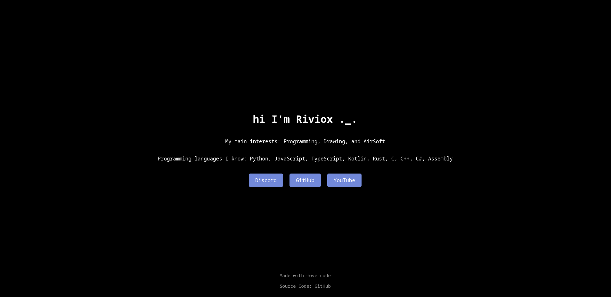

# riviox.is-a.dev

## Description

Welcome! This is the README for my website, which is available under the GNU GPL v3.0 license. This website showcases my interests, programming skills, and provides links to my GitHub, Discord, and YouTube profiles.

## Contents

- [Demo](#demo)
- [Screenshots](#screenshots)
- [Technologies](#technologies)
- [Installation](#installation)
- [Usage](#usage)
- [License](#license)
- [Contact](#contact)

## Demo

[Live Demo](https://riviox.is-a.dev)

## Screenshots

## Technologies

- HTML
- CSS
- JavaScript

## Installation

1. Clone this repository: `git clone https://github.com/your_username/repository.git`
2. Navigate to the project folder: `cd repository`

## Usage

Open the `index.html` file in your browser to see the website.

## License

This website is available under the GNU GPL v3.0 license. The full license text is available in the [LICENSE](LICENSE) file.

## Contact

If you have questions, feedback, or suggestions, feel free to reach out to me through [Discord](https://discord.com/), or via [GitHub Issues](https://github.com/RivioxGaming/riviox.is-a.dev/issues).

---

> This project is licensed under the terms of the GNU GPL v3.0 license.
> Created by .riviox.
